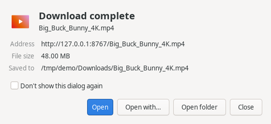

# TurboDM

A fast, multi-connection download manager for Linux and Windows — in the spirit of Internet Download Manager —
written in Rust with a native interface on each system (GTK4 on Linux; Windows' own controls on
Windows, drawn in the style of your Windows version), plus a browser extension that hands downloads over
from Firefox, Chrome, Brave and Chromium **with their cookies**, so links that only work while you're
logged in keep working.


| Per-download window (opens when a download starts) | Add download / Download complete |
|---|---|
|  |   |

## Features

- **Up to 32 connections per download** with IDM-style **dynamic segmentation**: when a connection
  finishes its part it takes over half of the largest part still downloading, so every connection
  stays busy. Like IDM, it only does so while that half is still worth a new connection at the
  current speed (a couple of seconds of work); near the end the busy connections just finish up.
- **Detects per-server connection limits.** Many servers refuse more than a few connections per IP
  (`HTTP 429`/`503`, or silently dropping them). Extra connections then retire and the working ones
  take over their parts — the download never stalls or fails because of it. Default is 8
  connections, like IDM.
- **Pause / resume that survives restarts and reboots.** Progress is saved continuously; resuming
  checks the server still has the same file (size / ETag) before continuing.
- **Browser integration** (Firefox, Chrome, Brave, Chromium): catches downloads and passes the
  **exact cookies, referrer and user-agent** the browser used (private windows and containers
  included), adds *Download with TurboDM* to the right-click menu, and lets the browser keep the
  download if TurboDM can't be reached. In Firefox, downloads are recognised from the server's
  response headers and taken over *before* Firefox saves anything — no half-finished copy, no
  entry in its download list, and tabs opened just for the download close themselves. Files saved
  with the browser's *Save … As* go to the folder you picked there. Talks
  through the browsers' native-messaging channel and a user-only Unix socket — no network port is
  opened.
- **Starts before you click Start**, like IDM: while the *Download file info* dialog is open the
  download quietly begins on a single connection, so it's already connected when you press
  *Start* — then every connection joins in without reconnecting. *Cancel* deletes what was
  fetched; you can turn this off in Preferences.
- **Queue** with a limit on simultaneous downloads, and a **global speed limit**.
- **Categories**: Video, Music, Documents, Compressed, Programs and Images go to their own sub-folders.
- **Main window with a sidebar**: downloads by state (all, downloading, unfinished, completed) and
  by category, with counts and the free space on the download disk; a toolbar for resume/pause
  (all), clearing finished downloads and opening the download folder; search (Ctrl+F) and sortable
  columns.
- **Refresh download address** for expired links, keeping the progress.
- **A window per download, like IDM's**, opening when a download starts or resumes (from the
  browser or the app): *Download status* with a live map of every connection's segment and a
  per-connection list, a *Speed limiter* for just that download, and *Options on completion* —
  open the file, or put the computer to sleep / shut it down (after a 30-second countdown you can
  cancel). It ends with a **Download complete** dialog: *Open*, *Open with…*, *Open folder*.
- Optional **clipboard catching** of download links, **desktop notifications**, **tray icon**
  (on Linux panels with a tray; otherwise closing the window minimizes it while downloading).
- Servers that reject a browser user-agent (anti-bot checks comparing it with the TLS fingerprint)
  are retried with TurboDM's own honest one.
- **Command line**: `turbodm get URL -c 16 -d ~/Downloads`.

### Fast by design

- Rust + tokio: 32 connections without 32 OS threads; reqwest forced to **HTTP/1.1 with one TCP
  connection per segment** (HTTP/2 would squeeze them into a single connection).
- Data is written **straight into its final position** in a preallocated file — no merge step.
- ~9 MB binary; the window is on screen in about 0.1 s. Nothing starts at login.

## Install

Download the latest version from the [releases page](https://github.com/xsobhi/turbodm/releases/latest):

| System | File |
|---|---|
| **Windows 10/11** (64-bit) | `TurboDM-…-windows-x64-setup.exe` — installs for all users and updates itself. Or the `-portable.zip`. |
| **Ubuntu 24.04+, Linux Mint 22+, Debian 13+** | `turbodm_…_amd64.deb` (`arm64` for ARM). Double-click it, or `sudo apt install ./turbodm_…_amd64.deb`. |
| **Fedora 40+, openSUSE Tumbleweed** | `turbodm-…x86_64.rpm` (`aarch64` for ARM): `sudo dnf install ./turbodm-….rpm` |

### With apt (Ubuntu, Mint, Debian)

```sh
sudo curl -fsSLo /usr/share/keyrings/turbodm-archive-keyring.gpg https://xsobhi.github.io/turbodm/turbodm-archive-keyring.gpg
sudo curl -fsSLo /etc/apt/sources.list.d/turbodm.sources https://xsobhi.github.io/turbodm/turbodm.sources
sudo apt update
sudo apt install turbodm        # or: sudo apt install tdm
```

Updates then arrive with your system updates. (Installing the `.deb` from the releases page sets
this up for you too, like Chrome and VS Code do.)

### From source (Linux)

Requirements: Rust ([rustup.rs](https://rustup.rs)), GTK4 development files and pkg-config
(`sudo apt install libgtk-4-dev pkg-config build-essential` on Debian/Ubuntu/Mint).

```sh
git clone https://github.com/xsobhi/turbodm.git
cd turbodm
./install.sh      # builds, installs to ~/.local, registers the browser connector
```

Remove with `./uninstall.sh` (add `--purge` to also delete your download list and settings).

### Browser extension

The extension comes with TurboDM, in:

- `/usr/share/turbodm/extension/` with the `.deb`/`.rpm` packages
- `~/.local/share/turbodm/extension/` with `install.sh`
- on Windows, the `extension` folder where TurboDM is installed (Start menu → *TurboDM* →
  *Browser extension folder*)

TurboDM connects itself to the browsers when it starts (`turbodm --register` does it by hand).

- **Chrome / Brave / Chromium / Edge**: open `chrome://extensions` (or `brave://extensions`), turn on
  *Developer mode*, click *Load unpacked* and pick the `chrome` folder from above.
- **Firefox**: release builds only install extensions signed by Mozilla. For a quick try, open
  `about:debugging#/runtime/this-firefox` → *Load Temporary Add-on* →
  `firefox/manifest.json` from the folder above (removed when Firefox restarts).
  For a permanent install, sign it for free as a self-distributed add-on with
  [web-ext](https://extensionworkshop.com/documentation/develop/web-ext-command-reference/#web-ext-sign):
  `npx web-ext sign --channel=unlisted --source-dir dist/firefox --api-key=… --api-secret=…`
  and open the resulting `.xpi` in Firefox.

The popup lets you switch catching on/off, set a minimum file size and list sites to leave alone.

## Using it

| Action | How |
|---|---|
| Add a link | `+` button or **Ctrl+N** (a copied link is pasted in automatically) |
| Resume / pause selected | **Ctrl+R** / **Ctrl+P** |
| Remove from list | **Delete** (right-click → *Delete with file* also removes it from disk) |
| Progress details | **Ctrl+I** or double-click a running download |
| Expired link | right-click → *Refresh download address…* |
| Preferences | **Ctrl+,** |

Debug connection behaviour with `TURBODM_DEBUG=1 turbodm get URL`.

## Privacy

Cookies from the browser are only sent to the server of the download they came with. TurboDM has no
telemetry. Besides your downloads, it only asks GitHub for the latest release (at start and once a
day) to tell you about updates; turn *Check for updates* off in Preferences to stop that.

## Development

```sh
cargo test --release     # unit tests + end-to-end engine tests against a local HTTP server
```

```
src/engine/   segmentation, connections, task runner, manager, persistence (no GUI)
src/ipc/      extension ↔ app: native-messaging host, Unix socket / named pipe client/server
src/register.rs  registers the native-messaging host (manifests; registry on Windows)
packaging/    .deb/.rpm files, Windows installer (Inno Setup), apt repository script
src/ui/       GTK4 interface (Linux)
src/win/      Windows interface (Win32 and common controls)
extension/    shared JS + Firefox (MV2) and Chrome (MV3) manifests
```

Every source file is kept under 200 lines.

Releases are built by GitHub Actions (`.github/workflows/release.yml`) when a version tag is
pushed: `git tag -a v1.4.0 -m "notes" && git push origin v1.4.0`. That builds the `.deb`, `.rpm`
and Windows installer, publishes the release, and updates the apt repository on GitHub Pages.

## License

MIT
