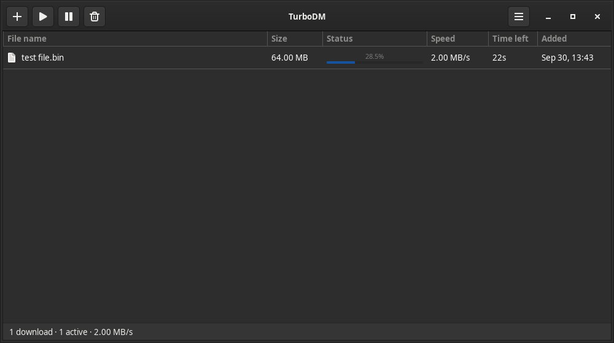
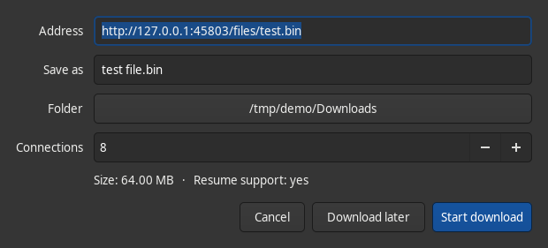
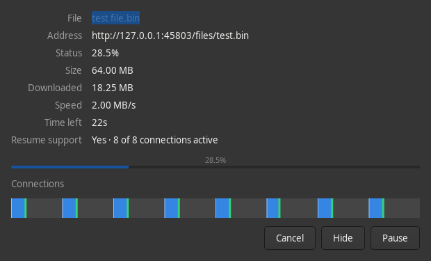

# TurboDM

A fast, multi-connection download manager for Linux — in the spirit of Internet Download Manager —
written in Rust with a native GTK4 interface, plus a browser extension that hands downloads over
from Firefox, Chrome, Brave and Chromium **with their cookies**, so links that only work while you're
logged in keep working.



| Add download | Progress (one bar segment per connection) |
|---|---|
|  |  |

## Features

- **Up to 32 connections per download** with IDM-style **dynamic segmentation**: when a connection
  finishes its part it takes over half of the largest part still downloading, so every connection
  stays busy until the very end.
- **Detects per-server connection limits.** Many servers refuse more than a few connections per IP
  (`HTTP 429`/`503`, or silently dropping them). Extra connections then retire and the working ones
  take over their parts — the download never stalls or fails because of it. Default is 8
  connections, like IDM.
- **Pause / resume that survives restarts and reboots.** Progress is saved continuously; resuming
  checks the server still has the same file (size / ETag) before continuing.
- **Browser integration** (Firefox, Chrome, Brave, Chromium): catches downloads and passes the
  page's **cookies, referrer and user-agent**, adds *Download with TurboDM* to the right-click menu,
  and lets the browser keep the download if TurboDM can't be reached. Talks through the browsers'
  native-messaging channel and a user-only Unix socket — no network port is opened.
- **Queue** with a limit on simultaneous downloads, and a **global speed limit**.
- **Categories**: Video, Music, Documents, Compressed, Programs and Images go to their own sub-folders.
- **Refresh download address** for expired links, keeping the progress.
- Per-download **progress window** with a live map of every connection's segment.
- Optional **clipboard catching** of download links, **desktop notifications**, **tray icon**
  (when your panel has a tray; otherwise closing the window minimizes it while downloading).
- Servers that reject a browser user-agent (anti-bot checks comparing it with the TLS fingerprint)
  are retried with TurboDM's own honest one.
- **Command line**: `turbodm get URL -c 16 -d ~/Downloads`.

### Fast by design

- Rust + tokio: 32 connections without 32 OS threads; reqwest forced to **HTTP/1.1 with one TCP
  connection per segment** (HTTP/2 would squeeze them into a single connection).
- Data is written **straight into its final position** in a preallocated file — no merge step.
- ~9 MB binary; the window is on screen in about 0.1 s. Nothing starts at login.

## Install

Requirements: Rust ([rustup.rs](https://rustup.rs)), GTK4 development files and pkg-config
(`sudo apt install libgtk-4-dev pkg-config build-essential` on Debian/Ubuntu/Mint).

```sh
git clone https://github.com/xsobhi/turbodm.git
cd turbodm
./install.sh      # builds, installs to ~/.local, registers the browser connector
```

Remove with `./uninstall.sh` (add `--purge` to also delete your download list and settings).

### Browser extension

`install.sh` builds the extension into `~/.local/share/turbodm/extension/`.

- **Chrome / Brave / Chromium**: open `chrome://extensions` (or `brave://extensions`), turn on
  *Developer mode*, click *Load unpacked* and pick `~/.local/share/turbodm/extension/chrome`.
- **Firefox**: release builds only install extensions signed by Mozilla. For a quick try, open
  `about:debugging#/runtime/this-firefox` → *Load Temporary Add-on* →
  `~/.local/share/turbodm/extension/firefox/manifest.json` (removed when Firefox restarts).
  For a permanent install, sign it for free as a self-distributed add-on with
  [web-ext](https://extensionworkshop.com/documentation/develop/web-ext-command-reference/#web-ext-sign):
  `npx web-ext sign --channel=unlisted --source-dir dist/firefox --api-key=… --api-secret=…`
  and open the resulting `.xpi` in Firefox.

The popup lets you switch catching on/off, set a minimum file size and list sites to leave alone.

## Using it

| Action | How |
|---|---|
| Add a link | `+` button or **Ctrl+N** (a copied link is pasted in automatically) |
| Resume / pause selected | **Ctrl+R** / **Ctrl+P** |
| Remove from list | **Delete** (right-click → *Delete with file* also removes it from disk) |
| Progress details | **Ctrl+I** or double-click a running download |
| Expired link | right-click → *Refresh download address…* |
| Preferences | **Ctrl+,** |

Debug connection behaviour with `TURBODM_DEBUG=1 turbodm get URL`.

## Privacy

Cookies from the browser are only sent to the server of the download they came with. TurboDM has no
telemetry and makes no network requests other than your downloads.

## Development

```sh
cargo test --release     # unit tests + end-to-end engine tests against a local HTTP server
```

```
src/engine/   segmentation, connections, task runner, manager, persistence (no GUI)
src/ipc/      extension ↔ app: native-messaging host, Unix-socket client/server
src/ui/       GTK4 interface
extension/    shared JS + Firefox (MV2) and Chrome (MV3) manifests
```

Every source file is kept under 200 lines.

## License

MIT
